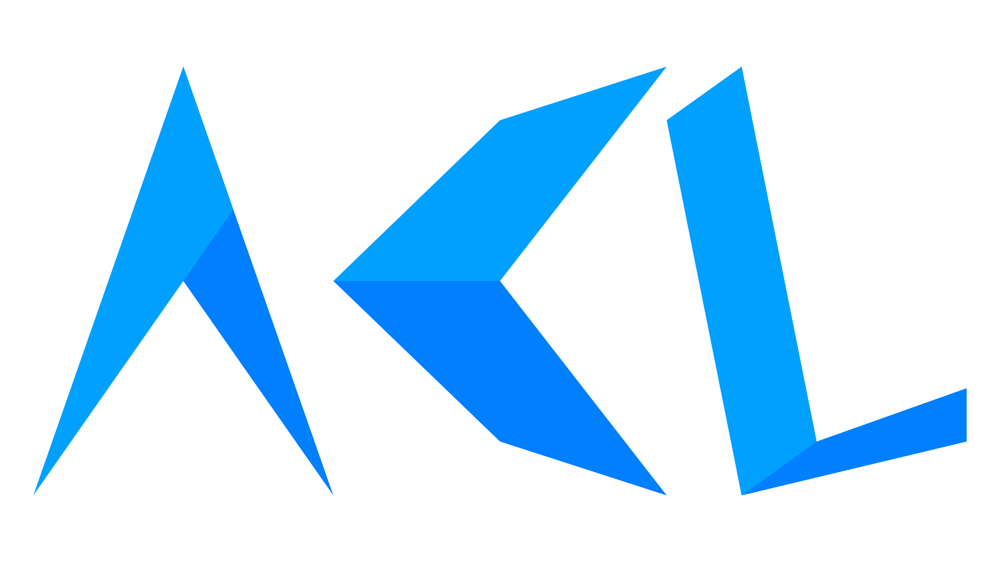

# ACL
ACL (Almond's Class Library) is a Monogame class library made with the purpose of simplyfing the creation of a new DesktopGL project by providing a simple base for 2D user interfaces, physics and more.

# Roadmap :
- Component Management System [✓]
  - Component [✓]
  - Component Manager [✓]
  - Camera class [✓]
- Screen Management System
  - Base Screen class [✓]
  - Screen Manager [✓]
- Built-in UI Elements [/]
  - Container [✓]
  - Button [✓]
  - Image [✓]
  - Checkbox [✓]
  - Text [✓]
  - Slider [~]
- File Manipulation Integration [✓]
  - File Manager [✓]
  - JSON Serialization/Deserialization [✓]
- 2D Physics Engine [~]
  - Physics Component [~]
  - Collision Checking [~]
  - Collision Resolving [X]
- Animations/Tweening [X]

```
 X => Unimplemented
 ~ => Work in progress
 / => Mostly implemented
 ✓ => Implemented
```

# Planned :
These are features that are planned for the far future, but are not part of the current Roadmap.
- Runtime font loading
- Custom audio implementation
